# Data Model

Diagrama ER completo do Sheipe.

## Diagrama

```mermaid
erDiagram

    %% ─── Usuários & Academias ───────────────────────────────────────────────

    User {
        int id
        string name
        string email
        string password_digest
        string role "athlete | trainer | admin"
        string avatar_url
        datetime created_at
    }

    Gym {
        int id
        string name
        string address
        string phone
        string logo_url
        datetime created_at
    }

    GymMembership {
        int id
        int user_id
        int gym_id
        string status "active | inactive | pending"
        date start_date
        date end_date
    }

    TrainerAthlete {
        int id
        int trainer_id
        int athlete_id
        int gym_id "nullable"
        string status "active | inactive"
        datetime created_at
    }

    Follow {
        int id
        int follower_id
        int following_id
        datetime created_at
    }

    %% ─── Equipamentos & Exercícios ──────────────────────────────────────────

    Equipment {
        int id
        int gym_id
        string name
        string category
    }

    Exercise {
        int id
        string name
        string description
        string muscle_group "chest | back | shoulders | biceps | triceps | legs | glutes | core | full_body"
        string category "strength | cardio | mobility"
        boolean is_system
        int creator_id "nullable - User"
        datetime created_at
    }

    ExerciseEquipment {
        int exercise_id
        int equipment_id
    }

    %% ─── Rotinas & Planos ───────────────────────────────────────────────────

    Routine {
        int id
        string name
        string description
        int creator_id
        boolean is_template
        datetime created_at
    }

    RoutineExercise {
        int id
        int routine_id
        int exercise_id
        int position
        string notes
    }

    RoutineSet {
        int id
        int routine_exercise_id
        int set_number
        float weight
        int reps
        int rest_seconds
        string set_type "warmup | working | dropset | failure"
    }

    RoutinePlan {
        int id
        string name
        int athlete_id
        int creator_id "pode ser trainer"
        date start_date
        date end_date
        string notes
    }

    RoutinePlanDay {
        int id
        int routine_plan_id
        int routine_id
        int day_of_week "0=Dom ... 6=Sab"
        int week_number "nullable - para periodização"
    }

    %% ─── Treinos ────────────────────────────────────────────────────────────

    Workout {
        int id
        int user_id
        int routine_id "nullable"
        int gym_id "nullable"
        datetime started_at
        datetime finished_at
        string notes
        string trainer_notes "nullable - visível só ao atleta e trainer"
    }

    WorkoutExercise {
        int id
        int workout_id
        int exercise_id
        int routine_exercise_id "nullable"
        int position
        string notes
    }

    WorkoutSet {
        int id
        int workout_exercise_id
        int set_number
        float weight
        int reps
        float rpe "1-10"
        boolean completed
        string notes
    }

    %% ─── Métricas Corporais ─────────────────────────────────────────────────

    BodyMetric {
        int id
        int user_id
        date measured_at
        float weight_kg
        float body_fat_pct "nullable"
        float muscle_mass_kg "nullable"
        float chest_cm "nullable"
        float waist_cm "nullable"
        float hip_cm "nullable"
        float arm_cm "nullable"
        float thigh_cm "nullable"
        string notes
    }

    %% ─── Social ─────────────────────────────────────────────────────────────

    WorkoutPost {
        int id
        int workout_id
        int user_id
        string caption
        string visibility "public | followers | private"
        datetime published_at
    }

    PostMedia {
        int id
        int workout_post_id
        string media_type "image | video"
        string url
        int position
    }

    PostLike {
        int id
        int workout_post_id
        int user_id
        datetime created_at
    }

    PostComment {
        int id
        int workout_post_id
        int user_id
        int parent_id "nullable - para respostas"
        string body
        datetime created_at
    }

    PostView {
        int id
        int workout_post_id
        int user_id "nullable - visitantes não autenticados"
        datetime viewed_at
        string source "feed | profile | discover | search"
    }

    PostTag {
        int id
        int workout_post_id
        string tag_type "muscle_group | exercise | gym"
        int tag_id
    }

    %% ─── Notificações ───────────────────────────────────────────────────────

    Notification {
        int id
        int recipient_id
        int actor_id "nullable"
        string notifiable_type "Workout | RoutinePlan | TrainerAthlete | WorkoutPost | PostComment"
        int notifiable_id
        string event "workout_completed | plan_assigned | athlete_inactive | trainer_request | trainer_request_accepted | body_metric_recorded | post_liked | post_commented | comment_replied | new_follower"
        datetime read_at "nullable"
        datetime created_at
    }

    %% ─── Relacionamentos ────────────────────────────────────────────────────

    User ||--o{ GymMembership : "pertence a"
    Gym ||--o{ GymMembership : "tem membros"
    Gym ||--o{ Equipment : "possui"
    User ||--o{ TrainerAthlete : "treina (trainer)"
    User ||--o{ TrainerAthlete : "é treinado (athlete)"
    User ||--o{ Follow : "segue"
    User ||--o{ Follow : "é seguido por"

    User ||--o{ Exercise : "cria"
    Exercise ||--o{ ExerciseEquipment : ""
    Equipment ||--o{ ExerciseEquipment : ""

    User ||--o{ Routine : "cria"
    Routine ||--o{ RoutineExercise : "contém"
    Exercise ||--o{ RoutineExercise : "aparece em"
    RoutineExercise ||--o{ RoutineSet : "tem"

    User ||--o{ RoutinePlan : "segue"
    RoutinePlan ||--o{ RoutinePlanDay : "tem dias"
    Routine ||--o{ RoutinePlanDay : "alocada em"

    User ||--o{ Workout : "realiza"
    Routine ||--o| Workout : "origina"
    Gym ||--o{ Workout : "ocorre em"
    Workout ||--o{ WorkoutExercise : "contém"
    Exercise ||--o{ WorkoutExercise : "executado em"
    RoutineExercise ||--o| WorkoutExercise : "baseado em"
    WorkoutExercise ||--o{ WorkoutSet : "tem"

    User ||--o{ BodyMetric : "registra"

    Workout ||--o| WorkoutPost : "publicado como"
    WorkoutPost ||--o{ PostMedia : "tem"
    WorkoutPost ||--o{ PostLike : "recebe"
    WorkoutPost ||--o{ PostComment : "recebe"
    PostComment ||--o{ PostComment : "respondido em"
    WorkoutPost ||--o{ PostView : "visualizado em"
    WorkoutPost ||--o{ PostTag : "taggeado com"

    User ||--o{ Notification : "recebe"
```

## Grupos de entidades

| Grupo | Entidades |
|---|---|
| Identidade | `User`, `Gym`, `GymMembership`, `TrainerAthlete`, `Follow` |
| Catálogo | `Exercise`, `Equipment`, `ExerciseEquipment` |
| Planejamento | `Routine`, `RoutineExercise`, `RoutineSet`, `RoutinePlan`, `RoutinePlanDay` |
| Execução | `Workout`, `WorkoutExercise`, `WorkoutSet` |
| Saúde | `BodyMetric` |
| Social | `WorkoutPost`, `PostMedia`, `PostLike`, `PostComment`, `PostView`, `PostTag` |
| Sistema | `Notification` |
